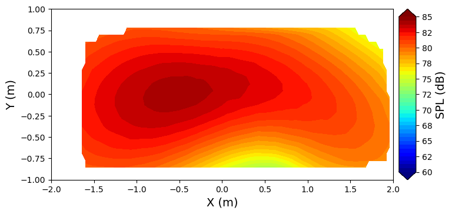
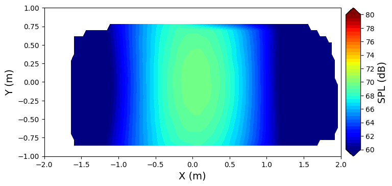

## Charm Automation Toolkit 
This python toolkit automates running and post-processing the vortex lattice / free wake rotorcraft solver CHARM, producing performance and acoustic data. This code was developed for the BU NASA ULI project. The demonstration scripts in the ```examples``` folder calculate propeller performance at different yaw angles and inflow velocities, and they produce the following acoustic directivity plots. 

### Performance output

| U (ft/s) | Tilt (deg) | RPM | Fx | Fy | Fz (lb) | Mx | My | Mz (lb*ft) |
|---|---|---|---|---|---|---|---|---|
| 0 | 0 | 4000 | -1.632e-02 | -5.952e-03 | -3.417e+01 | -2.903e-02 | 5.682e-02 | 5.009e+00 |
| 32.81 | 0 | 4000 | -1.882e+00 | 6.923e-01 | -3.651e+01 | -4.124e+00 | 5.650e+00 | 5.108e+00 |
| 0 | -90 | 4000 | 3.424e+01 | 9.944e-03 | 8.506e-03 | -5.007e+00 | -1.285e-03 | 4.954e-02 |
| 32.81 | -90 | 4000 | 2.661e+01 | -4.605e-05 | -1.754e-06 | -4.845e+00 | -1.030e-04 | 1.998e-05 |

### Acoustics output
#### Edgewise Inflow Case:


#### Axial inflow Case:

